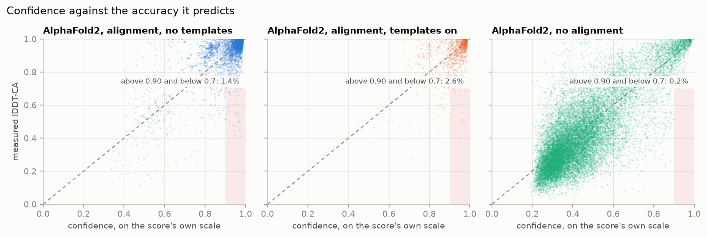
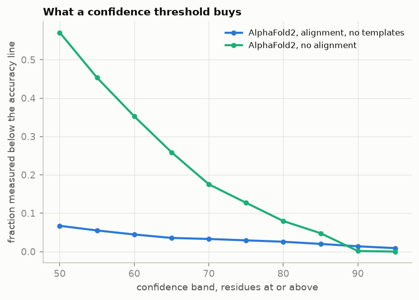
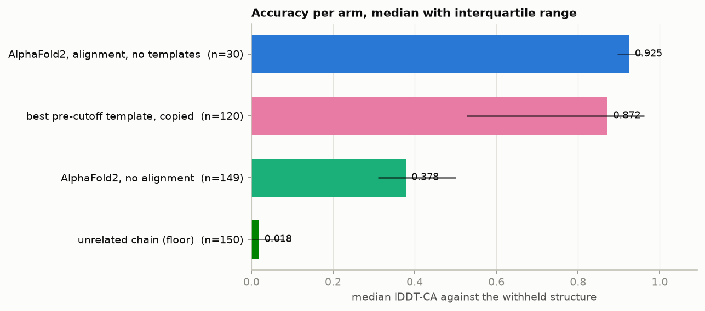
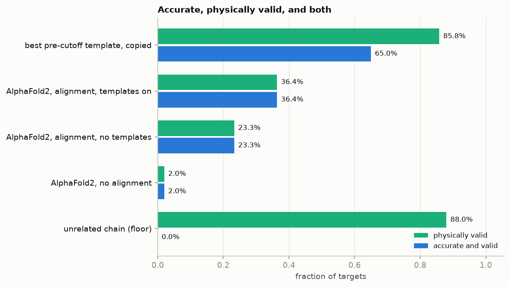
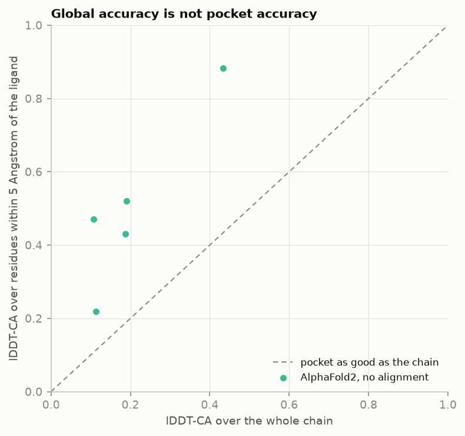

# What a structure prediction confidence score is worth

This repository measures what a per-residue confidence score entitles you to
believe about a predicted protein structure, and what docking a ligand into a
predicted receptor costs compared with docking into the experimental one. It
runs on one laptop without a GPU. Every number below was read from a file in
`results/` after the pipeline ran. None was estimated or remembered.

The five questions, and the short answers:

1. How well does the confidence score predict the accuracy it claims to
   predict? Well on average and badly in the tail. Over 30 targets, 34 of the
   2463 residues AlphaFold2 scored above 90 came back below 0.7 lDDT-CA, which
   is 1.4 per cent. The expected calibration error is 0.0141. There is no
   threshold at which the risk disappears.
2. Is a confident structure physically valid? Often not, by the standard
   deposited structures meet. Seven of 30 predictions fall inside the range the
   270 deposited structures in this set span, against 103 of 120 for the
   deposited structures themselves. The failures are almost all bond angles.
3. How much of the apparent accuracy comes from information the model should
   not have had? A great deal. Of 150 targets held out by both deposition and
   release date, 56 have a relative deposited before the cutoff with exactly
   the same sequence. Copying that relative scores 0.8825 median lDDT-CA where
   AlphaFold2 with an alignment scores 0.925.
4. What does docking into a predicted receptor cost? On the same 13 targets
   with the same protocol, success falls from 4 of 11 to 1 of 11 with one
   scoring function, and from 5 of 9 to 1 of 9 with the other.
5. What does a single-conformation model do with a mobile domain? It returns
   one arrangement, resembling some deposited structures and not others, and
   says nothing about the choice in its per-residue confidence. Its predicted
   aligned error does say something: 6.0 Angstroms within the domain against
   12.8 between the domain and the body.

## What you need to know to read this

Two numbers are easy to confuse and this repository keeps them apart
throughout.

lDDT is a measured quantity. It compares a model with an experimental
structure by asking, for every pair of residues close together in the
experiment, whether the model preserves that distance. It runs from 0 to 1, it
needs no superposition, and lDDT-CA is the alpha-carbon-only form. That is the
accuracy.

pLDDT is a prediction of lDDT-CA that the model emits alongside the structure,
on a 0 to 100 scale. It is a claim about accuracy, not a measurement of it,
and the first question here is how good that claim is. Calling it an accuracy
is the mistake this whole repository is about.

Predicted aligned error is a second confidence output, a matrix rather than a
vector. Entry `i, j` is the model's expected error in the position of residue
`i` if the structure is aligned on residue `j`. It is the only output that
says anything about how two parts of a structure sit relative to each other.

Docking produces a score in kilocalories per mole. It is an empirical
function fitted to reproduce rankings. It is not a measured binding free
energy and nothing here treats it as one.

## The arms, and why two of them are not predictions

Five arms produce a structure for each target:

`af2_nomsa` runs AlphaFold2 on the sequence alone, with no alignment. 149
targets.

`af2_msa_notmpl` runs it on an alignment from the ColabFold server with
templates off. 30 targets.

`af2_msa_tmpl` is the same with templates on. 12 targets.

`null_template` is not a prediction. It takes the closest relative deposited
before the training cutoff, copies its coordinates, and superposes them on the
target. It is what you would get by looking the answer up. 120 targets.

`null_unrelated` is also not a prediction. It takes a chain of comparable
length with no detectable relationship to the target. It is what the scale
looks like when there is no information at all. 150 targets.

The two floors are what make the other numbers readable. A benchmark without
them reports that a model scored 0.9 and leaves you to guess whether that is
impressive. Here you can see that copying a pre-cutoff relative also scores
0.8825, and that having nothing scores 0.016.

The floors also show why the choice of measure matters. An unrelated chain
scores 0.016 by lDDT-CA and 0.303 by TM-score. TM-score has a floor for any
pair of structures of similar size, so a metric that cannot reach zero cannot
tell you when you have nothing. Every headline here uses lDDT-CA.

## The set, and what a date filter is worth

The set is built from the RCSB archive by asking for protein entities released
after the latest training cutoff of the models compared, which is 1 June 2023.
7189 entities passed the structural filters and clustered into 1391 groups at
the identity threshold. 320 candidates were examined in detail, 313 survived
the sequence checks, and 163 were cut to fit the wall clock available, leaving
150.

Filtering by release date alone would have produced 1682 clusters rather than
1391. The 291 extra clusters are entries deposited before the cutoff and
released after it. A model that selected its training examples by deposition
date is not protected by a release-date filter, and both dates are recorded
for every target here so the stricter one is used.

That filter still does not deliver novelty. For each of the 150 targets the
archive was searched for the closest relative deposited before the cutoff:

| closest pre-cutoff relative | targets |
|---|---|
| exactly 100 per cent identical | 56 |
| 95 to 100 per cent | 67 |
| 70 to 95 per cent | 12 |
| 30 to 70 per cent | 38 |
| below 30 per cent | 3 |
| nothing found | 30 |

More than a third of a strictly date-filtered held-out set is the same
sequence as something already in the archive before the model was trained.
This is the single most important thing to know before reading any accuracy
number computed on a set built this way, including the ones below.

## Calibration

Over the 30 targets of the alignment arm, 3213 residues carry both a
confidence value and a measured lDDT-CA.

| arm | targets | Pearson r | expected calibration error | above 90 and below 0.7 |
|---|---|---|---|---|
| AlphaFold2, alignment, no templates | 30 | 0.7346 | 0.0141 | 34 of 2463, 1.4 per cent |
| AlphaFold2, alignment, templates on | 11 | 0.512 | 0.0297 | 23 of 874, 2.6 per cent |
| AlphaFold2, no alignment | 149 | 0.7983 | 0.0245 | 1 of 663, 0.2 per cent |



Each point is one residue. The dashed line is where a perfectly calibrated
score would put it. The shaded box is the region the last column of the table
counts: confident and wrong.

The correlation is the least useful of these. What a reader wants to know is
what happens when the model is confident, and that is the last column.

The single-sequence arm looks safest by that column and is the worst model
here by every other measure. It almost never claims high confidence, so it
almost never claims it wrongly. A low rate of confident errors is not a virtue
when it is bought by refusing to be confident.

Sweeping the confidence band for the alignment arm gives the shape of the risk:

| confidence at or above | residues | of those below 0.7 lDDT-CA |
|---|---|---|
| 50 | 3153 | 6.7 per cent |
| 60 | 3051 | 4.5 per cent |
| 70 | 2976 | 3.3 per cent |
| 80 | 2884 | 2.6 per cent |
| 90 | 2463 | 1.4 per cent |
| 95 | 1665 | 0.9 per cent |



There is no knee. The risk falls smoothly and never reaches zero. Anyone who
quotes a single cutoff above which a prediction can be trusted is choosing a
point on this curve, and the curve is the answer rather than the point.



## Physical validity

A structure can be close to the truth and still not be the kind of object a
protein is. Bond lengths, bond angles, chirality, peptide bond planarity,
non-bonded clashes and backbone dihedral angles are checked for every
structure.

Choosing a standard needed care. The obvious one, that a structure should have
none of any of these faults, is met by under a third of the deposited
structures in this set. A standard most crystal structures fail measures
perfection rather than validity. So the thresholds are taken from the 270
deposited structures here, at the 95th percentile of each check: at most 4 bad
bonds, 0 bad angles, 0 clashes, 0 chirality errors, 1 cis peptide outside
proline, 2 twisted peptides, 9 Ramachandran outliers. The deposited arms then
pass 86 and 88 per cent of the time, which is what shows the standard is one
reality meets.

| arm | inside the range deposited structures span |
|---|---|
| copied pre-cutoff template | 103 of 120 |
| unrelated chain | 132 of 150 |
| AlphaFold2, alignment, templates on | 4 of 11 |
| AlphaFold2, alignment, no templates | 7 of 30 |
| AlphaFold2, no alignment | 3 of 149 |

The reason is specific. Of the alignment-arm structures outside the range,
every one is outside on bond angles, and deposited structures essentially
never carry an angle twelve standard deviations from ideal. Chirality, cis
peptides and clashes are within the experimental range.

Requiring accuracy and validity together changes the ranking:

| arm | physically valid | accurate and valid |
|---|---|---|
| copied pre-cutoff template | 85.8 per cent | 65.0 per cent |
| AlphaFold2, alignment, templates on | 36.4 per cent | 36.4 per cent |
| AlphaFold2, alignment, no templates | 23.3 per cent | 23.3 per cent |
| AlphaFold2, no alignment | 2.0 per cent | 2.0 per cent |
| unrelated chain | 88.0 per cent | 0.0 per cent |



AlphaFold2 is more accurate than the copied template and loses to it on this
combined measure. The unrelated chain is 88 per cent valid and 0 per cent
accurate, which is the control that shows the two axes are independent.

## What the alignment and the templates are worth

The arms cover different target sets, because an alignment arm costs about
twelve times the single-sequence arm and grows with the square of the sequence
length. Comparing medians across arms would compare different proteins, so
every pair is also compared as a difference per target over the targets both
arms cover, with an interval that resamples targets rather than residues.

| comparison | shared targets | median difference in lDDT-CA | interval |
|---|---|---|---|
| templates on, against templates off | 11 | 0.002 | 0.000 to 0.008 |
| alignment, against no alignment | 30 | 0.476 | 0.311 to 0.546 |
| alignment arm, against the copied template | 19 | 0.109 | 0.032 to 0.185 |

The alignment is worth a great deal. The templates are worth nothing
measurable on top of it: whatever a template carries, the alignment carried it
already. And the margin of the model over simply copying the best pre-cutoff
relative is 0.109 lDDT-CA on the median target.

The templates figure needs a scale to be read against, so one target was
predicted five times under five seeds with everything else held fixed. The
five predictions score 0.9200, 0.9220, 0.9220, 0.9230 and 0.9240 lDDT-CA, a
range of 0.004 and a standard deviation of 0.0015. The templates effect of
0.002 is smaller than the spread the model produces from nothing but its own
random seed. The alignment effect of 0.476 is more than a hundred times it.

## Docking into a predicted receptor

The docking is done by the previous stage of this work, called at a pinned
commit and not modified here, so that the docking protocol is identical
between arms and only the receptor changes. Its repository is
`vina_gnina_pose_benchmark_pipeline` at commit `313851a`.

Two arms dock the same 13 ligands with the same settings. One uses the
experimental receptor, the other the predicted one superposed into the
experimental frame. A third arm places the search box without reference to the
ligand and is the negative control.

| receptor | scoring function | success | rate | 95 per cent interval | median top-1 RMSD |
|---|---|---|---|---|---|
| experimental | vina | 4 of 11 | 36.4 per cent | 15.2 to 64.6 | 6.33 Angstroms |
| experimental | vinardo | 5 of 9 | 55.6 per cent | 26.7 to 81.1 | 1.91 Angstroms |
| predicted | vina | 1 of 11 | 9.1 per cent | 1.6 to 37.7 | 7.90 Angstroms |
| predicted | vinardo | 1 of 9 | 11.1 per cent | 2.0 to 43.5 | 7.71 Angstroms |
| control, box not on the ligand | vina | 0 of 12 | 0.0 per cent | 0.0 to 24.3 | 6.75 Angstroms |

Success requires the pose within 2 Angstroms and every physical check passed.

The effect is large and the intervals are wide, because 9 to 11 targets is a
small number. The honest statement is that docking into a predicted receptor
lost most of the success rate on this set, and that with these counts the
difference is strong but not decisive.

The published figure for the same scoring function and the same docking arm in
the previous stage is 53.5 per cent, on 299 targets. That is not the
comparator. Those targets are drug-like ligands and these are nucleotides,
cofactors and a heme, which have many more rotatable bonds and dock far less
well. The experimental-receptor arm here, on these targets, is the comparator,
and it is why that arm exists.

Two of the 15 targets originally chosen were dropped because every copy of
their ligand binds a different protein in the same crystal. Four more could
not be docked at all: an iron-bearing heme that the charge model has no
parameters for, a boron-bearing ligand that vina has no atom type for, and two
that vinardo rejected. All are recorded in `results/excluded.tsv` with the
reason the software gave.

The binding site itself is predicted as well as the rest of the chain when the
model is good, and worse than the rest when it is not. At a 5 Angstrom radius
the alignment arm scores 0.930 in the pocket against 0.928 over the chain, and
the single-sequence arm 0.297 against 0.391.



## A domain that the record shows in more than one place

The application arm asks what a single-conformation model does with a domain
that experiment places differently in different structures. The subject is the
N-terminal domain of the porcine epidemic diarrhoea virus spike protein, which
six deposited entries place in two distinct arrangements.

Nothing here decides which arrangement is correct. The arm reports what the
prediction resembles and stops.

The domain boundary is derived from the coordinates rather than quoted. Two
independent methods agree on it: the contact-density search puts it at residue
231 in three of the six entries, and the displacement profile between entries,
fitted on the rigid part, ends at 231. The construct is that domain plus 98
residues of the body, 299 in total, which is what the measured memory curve
allows on this machine.

Fitted on the body, the alignment prediction places the domain:

| against | domain displacement |
|---|---|
| 6VV5 | 8.1 Angstroms |
| 7Y6T | 9.6 Angstroms |
| 7W6M | 12.5 Angstroms |
| 6U7K | 35.4 Angstroms |
| 7Y6S | 47.5 Angstroms |
| 7W73 | 52.8 Angstroms |

The deposited entries differ from each other by up to 54.5 Angstroms in the
same measure. The prediction resembles the arrangement shared by 6VV5 and
7Y6T and does not resemble the one in 7W73 and 7Y6S.

What the model said about it is the more useful half:

| quantity | alignment arm | no-alignment arm |
|---|---|---|
| mean confidence, domain | 84.07 | 37.00 |
| mean confidence, body | 70.20 | 25.27 |
| predicted aligned error within the domain | 6.0 Angstroms | 19.2 Angstroms |
| predicted aligned error, domain against body | 12.8 Angstroms | 26.1 Angstroms |

The per-residue confidence is high and says nothing about the arrangement. The
predicted aligned error between the domain and the body is twice that within
the domain, which is the model reporting that it knows the fold better than it
knows where the fold sits. A reader looking only at the per-residue score
would not see the warning.

A single-chain construct says nothing about how three copies of this protein
pack against each other, and this arm does not claim otherwise.

## What went wrong, and how it was caught

Four measurement faults were found and fixed while this ran. Three were the
same mistake, and it is the mistake this repository exists to warn about.

Each time, the code took whichever chain came first instead of the chain the
measurement was about.

The scoring stage compared a single-chain prediction against the whole
deposited entry. lDDT counts every reference contact the model fails to
reproduce, so each partner chain the model was never given counted against it.
An entry with six chains scored 0.136 where the chain alone scored 0.940, four
chains 0.164 against 0.963, two chains 0.377 against 0.950. Single-chain
entries were identical either way, which is what identified the cause. Read as
it stood, the data said the model was confidently wrong on two thirds of the
set, with confidence near 95 on structures measuring 0.14.

The docking subset chose each ligand by crystallographic fit quality and
ignored which chain it sat in. An entry with several copies of the protein has
a copy of the ligand in each. On four of fifteen targets the chosen copy was
6.6, 9.5, 10.7 and 17.1 Angstroms from the receptor, so the search box sat
beside it in solvent. That is why the first docking results came back near
zero.

The floor builder took the first polymer chain of whatever entry the sequence
search returned. A search returns an entity, and the entry holding it may be a
ribosome. The floor then scored 0.013 for a template 86 per cent identical to
its target, and was worse in the 70 to 95 per cent identity band than in the 30
to 70 band. A floor that goes backwards in identity is not a floor.

The fourth fault was different. Predictions written in the legacy format carry
no sequence-position field, so every stage that paired a prediction with an
experimental structure by that field paired nothing at all, silently. It hit
the docking handoff, where all 15 receptors failed to prepare, and the
application arm, which compared nothing and reported success.

None of these produced an error message. Each produced a plausible number.
The first was caught because a prediction with confidence 95 measuring 0.14
lDDT-CA is not something AlphaFold2 does, the second because the success rate
was below the negative control, and the third because accuracy rose as
sequence identity fell.

Several stages also used the existence of their own output file as a signal
that they had already run. The scoring stage skipped 30 finished predictions
that way; the geometry stage had checked 4 structures out of 449 and reported
success. Both now resume rather than skip. The tables that stages append to
also stacked rows across reruns, which once left two rows for every floor and
doubled a denominator. `scripts/05a_reconcile_predictions.py` compares the
prediction table against the files on disk and refuses when they disagree.

## Cost

The run is 190 predictions and about 16.5 hours of inference on 16 threads
with no GPU, within a 5 GB memory budget.

| arm | predictions | median seconds | median peak memory |
|---|---|---|---|
| AlphaFold2, no alignment | 149 | 155 | 2753 MB |
| AlphaFold2, alignment, no templates | 30 | 843 | 3410 MB |
| AlphaFold2, alignment, templates on | 11 | 986 | 3781 MB |

An alignment costs about twelve times the single-sequence arm at the same
length, and the cost grows with the square of the length. One alignment arm
over all 150 targets would have been 76 hours on this machine. Each arm was
given a stated budget and `scripts/02a_select_arm_subsets.py` spent it, keeping
every docking target and choosing the rest to span the length range rather than
taking the shortest, which would have bought three times as many targets and
confined every statement to small single-domain proteins.

## What this does not show

The alignment arms cover 30 and 12 targets. Intervals are given for every
comparison and they are wide. Nothing here should be read as a precise
estimate.

The docking comparison rests on 9 to 11 scored targets per scoring function.

Boltz-2 was planned as a second model and was not run. Its weights and their
inference did not fit in the disk this machine had left. That is a limitation
of the run rather than a finding, and the comparison it would have supported,
between a model whose cutoff precedes every entry of the application subject
and one whose cutoff follows several of them, is not made here.

The five-model subset was planned and not run. The seed-variance measurement
rests on one target, so it gives the scale of run-to-run spread for that
protein rather than for the set.

Every accuracy number is measured against one chain of one deposited
structure. Where the experiment itself places a domain in more than one
position, as the application arm shows, there is no single right answer to
measure against.

## Reproducing it

```
bash run_all.sh
```

`scripts/00_configure.sh` measures the machine, fits a memory and time curve,
projects the disk and wall clock the run needs, and refuses rather than
starting something that cannot finish. Every stage can be run alone and every
stage records what it did in `logs/`.

The stages in order are in `run_all.sh`. `results/` holds every table the
report and this file quote. `scripts/12_report.qmd` renders the full analysis
from those tables and reads nothing else. The rendered report is not tracked:
it is 2.9 MB of embedded fonts and third-party stylesheets and it is
regenerated by the last stage of `run_all.sh` into `results/report/`.

`scripts/check_repo.sh` checks that the scripts parse, that no tracked file
identifies the machine or the account, that no file over 50 MB or any model
weight is tracked, and that the figures this file refers to exist.

## Sources and licences

Every external source is pinned in `config/sources.tsv` with the identifier it
is pinned to and the licence it carries. Structures and sequence data come
from the RCSB Protein Data Bank under CC0. Alignments come from the ColabFold
server. Ramachandran contour grids come from the Richardson laboratory's
`rotarama_data` under CC BY 4.0. Accuracy is measured with OpenStructure 2.12.0
and US-align.

ColabFold's own code is MIT. The AlphaFold2 parameters it downloads are a
separate work under a separate licence, and which licence applies is not as
simple as quoting the current README of either project. The parameter archive
fetched for this model type carries an embedded licence file whose text is the
non-commercial share-alike variant, while the model's repository now states
that the parameters are licensed for any use with attribution and describes
that as a relicensing with no change to the parameters. Both facts are
recorded, and `scripts/05_predict.sh` writes the licence file it actually found
inside the archive into `results/environment/` so a reader can check rather
than take either statement on trust.

This repository is MIT licensed. See `LICENSE`.
